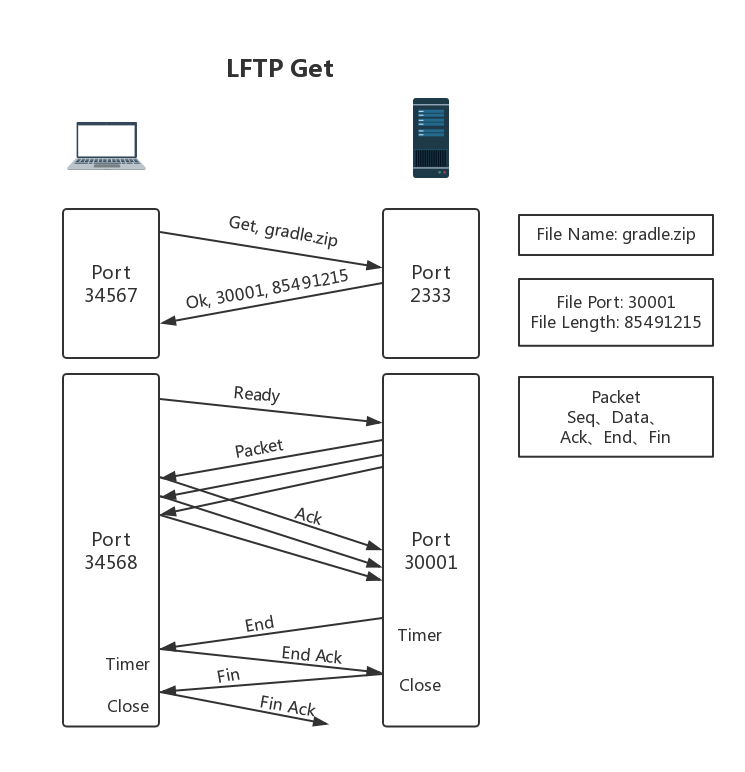
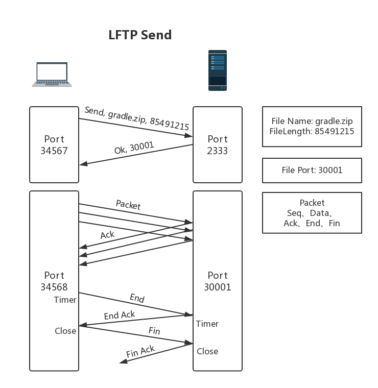

# LFTP设计文档

主要代码结构如下：

```
LFTP
|-- src
    |-- main
        |-- java
            |-- com
                |-- icytown
                    |-- course
                        |-- lftp
                            |-- Main.java
                            |-- command
                            |   |-- LGet.java
                            |   |-- LSend.java
                            |   |-- Root.java
                            |   |-- Serve.java
                            |-- network
                            |   |-- FileReceiver.java
                            |   |-- FileSender.java
                            |   |-- Packet.java
                            |   |-- PacketSocket.java
                            |   |-- Server.java
                            |   |-- SocketPool.java
                            |-- util
                                |-- Console.java
```

## 网络设计原理

本次实验要求使用UDP协议，实现以下功能。

### 文件传输

- `FileSender` 文件发送方，`lget` 时的服务器、`lsend` 时的客户端
- `FileReceiver` 文件接收方，`lget` 时的客户端、`lsend` 时的服务器

### 可靠性

模仿TCP的**流水线可靠数据传输协议**：

- 协议的发送方缓存多个已发送、未确认的分组，接收方缓存已正确接收的分组
- 每次连续发送一定的数目的包，之后等待接收方发来的ACK

其差错恢复选用**回退N步协议**：

- 对分组的确认采取累积确认
- 接收方丢弃所有失序的分组
- 发送方每发送一个分组，启动一个定时器，收到对应ACK后终止定时器，超时事件发生后重传，超时间隔加倍
- 发送方收到3个冗余ACK，进行快速重传
- 发送方所有的已发送、未确认的分组的数目不超过 `N`

### 流量控制

- 接收方维护一个变量 `rcvWindow` 接收窗口，在ACK包里通告该变量给发送方
- 接收方维护一个接收缓存 `rcvBuffer`
- 如果接收方的 `rcvWindow` 不足，发送方会持续发送只有一个字节数据的报文段，直到接收方发回一个包含非0的 `rcvWindow` 的ACK包

### 拥塞控制

- 发送方维护一个变量 `cWindow` 拥塞窗口
- 发送方维护一个变量 `ssthresh` 慢启动阈值

### 并发用户访问

- 服务器维护一个套接字池 `SocketPool`
- 每个套接字对应一个 `FileSender` 或 `FileReceiver` 进程
- 服务器每接收到一个请求，如果该请求可以满足，则为之分配一个套接字，创建一个新的文件传输进程

### lget



### lsend



## 网络实现模块 `network`

该部分是对LFTP的实现。

### 套接字池 `SocketPool`

使用 `Map<String, DatagramSocket>` 来存储每个地址对应的UDP套接字。主要运行在服务器上。

`Map.Entry<DatagramSocket, Integer> getSocketAndPort(String url)` 为 `url` 创建一个新的套接字，并返回该套接字和它的端口。

`void removeSocket(String url)` 移除该 `url` 对应的套接字。

```java
public class SocketPool {

    private static Map<String, DatagramSocket> pool = new HashMap<>();

    public static Map.Entry<DatagramSocket, Integer> getSocketAndPort(String url) {
        if (!pool.containsKey(url)) {
            synchronized (SocketPool.class) {
                try {
                    DatagramSocket socket = new DatagramSocket();
                    pool.put(url, socket);
                    return new AbstractMap.SimpleEntry<>(socket, socket.getLocalPort());
                } catch (SocketException e) {
                    return null;
                }
            }
        } else {
            return new AbstractMap.SimpleEntry<>(null, pool.get(url).getLocalPort());
        }
    }

    public static void removeSocket(String url) {
        synchronized (SocketPool.class) {
            DatagramSocket socket = pool.remove(url);
            if (socket != null) {
                socket.close();
            }
        }
    }
}

```

### 自定义包 `Packet` 

为了实现可靠性、流量控制、拥塞控制等，我们需要在UDP包的数据体里加入一些额外的字段：

- `id` 该分组的序号

- `ack` ACK标志

- `end` 文件结束标志

- `fin` 传输结束标志

- `rcvWindow` 接收窗口

- `data` 真正的数据体

`Packet` 实现了 `Serializable` 可序列化接口，所以可以：

- 由以上字段进行序列化，生成字节序列（通过 `byte[] getBytes()` 方法完成）
- 由字节序列进行反序列化，生成 `Packet` （通过 `Packet fromBytes(byte[] bytes)` 方法完成）

```java
package com.icytown.course.lftp.network;

import java.io.*;

public class Packet implements Serializable {

    private int id;

    private boolean ack;
    private boolean end;
    private boolean fin;
    private int rcvWindow;
    private byte[] data;

    private transient OnCallbackListener onCallbackListener;

    public Packet(int id) {
        this.id = id;
    }

    public Packet(int id, boolean ack) {
        this.id = id;
        this.ack = ack;
    }

    public Packet(int id, boolean ack, int rcvWindow) {
        this.id = id;
        this.ack = ack;
        this.rcvWindow = rcvWindow;
    }

    public void setEnd(boolean end) {
        this.end = end;
    }

    public void setFin(boolean fin) {
        this.fin = fin;
    }

    public int getId() {
        return id;
    }

    public boolean isAck() {
        return ack;
    }

    public boolean isEnd() {
        return end;
    }

    public boolean isFin() {
        return fin;
    }

    public int getRcvWindow() {
        return rcvWindow;
    }

    public void setData(byte[] data) {
        this.data = data.clone();
    }

    public byte[] getData() {
        return data;
    }

    public void setOnCallbackListener(OnCallbackListener onCallbackListener) {
        this.onCallbackListener = onCallbackListener;
    }

    public static Packet fromBytes(byte[] bytes) {
        try (ByteArrayInputStream bis = new ByteArrayInputStream(bytes);
             ObjectInput in = new ObjectInputStream(bis)) {
            return (Packet) in.readObject();
        } catch (IOException | ClassNotFoundException e) {
            return null;
        }
    }

    public byte[] getBytes() {
        try (ByteArrayOutputStream bos = new ByteArrayOutputStream();
             ObjectOutput out = new ObjectOutputStream(bos)) {
            out.writeObject(this);
            out.flush();
            byte[] bytes = bos.toByteArray();
            return bytes;
        } catch (IOException e) {
            return null;
        }
    }

    public interface OnCallbackListener {
        void onSuccess(Packet packet);
    }
}

```

###自定义套接字 `PacketSocket`

`byte[] send(DatagramSocket socket, String ip, int port, long timeOut, byte[] body, String msg)` 用于在开始文件传输前，发送文件传输的请求。

发送请求后，启动 `TimeOutTask` ，检测接收响应是否超时。

每3次超时，重新发送一次请求；发生20次超时，则判断为网络故障，中止发送请求。

接收到响应后，返回响应体给调用者。

```java
package com.icytown.course.lftp.network;

import com.icytown.course.lftp.util.Console;

import java.io.IOException;
import java.net.*;

public class PacketSocket {

    private static boolean flag = false;

    public static byte[] send(DatagramSocket socket, String ip, int port, long timeOut, byte[] body, String msg) {
        try {
            Packet result = null;
            Packet packet = new Packet(0);
            packet.setData(body);
            byte[] data = packet.getBytes();
            DatagramPacket datagramPacket = new DatagramPacket(data, data.length, new InetSocketAddress(ip, port));
            new Thread(new TimeOutTask(socket, datagramPacket)).start();
            byte[] recData = new byte[1400];
            DatagramPacket recDatagramPacket = new DatagramPacket(recData, recData.length);
            Console.out(msg);
            socket.send(datagramPacket);
            while (!flag) {
                socket.receive(recDatagramPacket);
                Packet recPacket = Packet.fromBytes(recDatagramPacket.getData());
                if (recPacket != null && recPacket.getId() == 0 && recPacket.isAck()) {
                    synchronized (PacketSocket.class) {
                        flag = true;
                    }
                    result = recPacket;
                    break;
                }
            }
            Console.out("Send request successfully.");
            if (result == null) {
                return null;
            } else {
                return result.getData();
            }
        } catch (SocketException e) {
            Console.err("Send failed, can not create socket.");
        } catch (UnknownHostException e) {
            Console.err("Send failed, unknown host.");
        } catch (IOException e) {
            Console.err("Send failed.");
        }
        return null;
    }

    public static class TimeOutTask implements Runnable {

        private long time;
        private DatagramSocket socket;
        private DatagramPacket packet;

        public TimeOutTask(DatagramSocket socket, DatagramPacket packet) {
            this.socket = socket;
            this.packet = packet;
        }

        public void updateTime() {
            synchronized (TimeOutTask.this) {
                time = System.currentTimeMillis();
            }
        }

        public long getTime() {
            synchronized (TimeOutTask.this) {
                return time;
            }
        }

        @Override
        public void run() {
            updateTime();
            int count = 0;
            while (!flag) {
                if (System.currentTimeMillis() - getTime() > 300) {
                    try {
                        count++;
                        if (count % 3 == 0) {
                            Console.err("Time out, send request to " + packet.getAddress().getHostName() + ":" + packet.getPort() + " again.");
                        }
                        if (count == 20) {
                            Console.err("Time out, please checkout your network.");
                            System.exit(-2);
                        }
                        socket.send(packet);
                    } catch (IOException e) {
                        e.printStackTrace();
                    }
                    updateTime();
                }
            }
        }
    }
}

```

### 文件发送方 `FileSender`

四个线程或定时任务：

- `AckTask` **接收**来自文件接收方的ACK。

- `TimeOutTask` 检测超时事件，进行**重传**，和关于**拥塞**窗口、慢启动阈值的控制。

- `FinishTimeOutTask` 文件传输完成后的**结束**阶段，清除当前接收方的相关套接字、定时器，显示相关信息。

- `SpeedTask` 显示文件传输**速率**。

在 `FileSender` 的 `run` 中，进行数据包的**发送**：

- 接收窗口不为0时、已发送未确认的队列未满时、拥塞窗口未满时，发送新的包，包放入已发送、未确认的缓存队列中。
  - 如果包是最后一个要发送的数据包，设其 `end` 标志位为 `true` 。
- 接收窗口为0时，发送只有一个字节数据的报文段，探测接收窗口的变化。

```java
public class FileSender implements Runnable {

    private DatagramSocket socket;
    private InetAddress address;
    private int port;
    private String url;
    private String filepath;
    private long filelength;
    private boolean server;

    private Timer speedTimer = new Timer();
    private Timer finishTimer = new Timer();
    private final SpeedTask speedTask = new SpeedTask();
    private final TimeOutTask timeOutTask = new TimeOutTask();
    private final AckTask ackTask = new AckTask();

    private int lastSeqAcked = 0;               // 上一个被确认的序号
    private int lastSeqSent = 0;                // 上一个已发送的序号
    private int rcvWindow = 10240;              // 接收窗口
    private double cWindow = 1;                 // 拥塞窗口
    private int ssthresh = 10;
    private Map<Integer, Packet> notAckedBuffer = new HashMap<>(); // 缓存已发送、未确认的分组
    private boolean finish = false;

    public FileSender(DatagramSocket socket, InetAddress address, int port, String url, String filepath, long filelength, boolean server) {
        this.socket = socket;
        this.address = address;
        this.port = port;
        this.url = url;
        this.filepath = filepath;
        this.filelength = filelength;
        this.server = server;
    }

    @Override
    public void run() {
        try (FileInputStream fis = new FileInputStream(new File(filepath))) {
            int read = 0;
            new Thread(ackTask).start();
            new Thread(timeOutTask).start();
            if (!server) {
                speedTimer.schedule(speedTask, 1000, 1000);
            }
            while (read != -1) {
                synchronized (FileSender.class) {
                    if (rcvWindow != 0) {
                        if (lastSeqSent - lastSeqAcked <= rcvWindow && lastSeqSent - lastSeqAcked <= cWindow) {
                            lastSeqSent++;
                            Packet packet = new Packet(lastSeqSent, false);
                            byte[] data = new byte[1024];
                            read = fis.read(data);
                            if (read == -1) {
                                packet.setEnd(true);
                            } else {
                                packet.setData(Arrays.copyOf(data, read));
                            }
                            notAckedBuffer.put(packet.getId(), packet);
                            byte[] bytes = packet.getBytes();
                            DatagramPacket datagramPacket = new DatagramPacket(bytes, bytes.length, address, port);
                            socket.send(datagramPacket);
                            // Console.out("Send to " + url + ", with packet " + packet.getId() + ".");
                        }
                    } else {
                        // 接收窗口满时，发送只有一个字节数据的报文段，其seq为0
                        Packet packet = new Packet(0);
                        byte[] data = packet.getBytes();
                        DatagramPacket datagramPacket = new DatagramPacket(data, data.length, address, port);
                        socket.send(datagramPacket);
                    }
                }
            }
            finishTimer.schedule(new FinishTimeOutTask(), server ? 3000 : 1000);
        } catch (IOException e) {
            e.printStackTrace();
        }
    }

    public class AckTask implements Runnable {

        private int duplicateAck = 0;

        @Override
        public void run() {
            byte[] bytes = new byte[1400];
            DatagramPacket datagramPacket = new DatagramPacket(bytes, bytes.length);
            while (!finish) {
                try {
                    socket.receive(datagramPacket);
                    Packet packet = Packet.fromBytes(datagramPacket.getData());
                    if (packet != null && packet.isAck()) {
                        synchronized (AckTask.this) {
                            rcvWindow = packet.getRcvWindow();
                        }
                        if (packet.getId() >= lastSeqAcked + 1) {
                            // Console.out("Receive from " + url + ", with ack " + packet.getId() + ".");
                            synchronized (FileSender.this) {
                                for (int i = lastSeqAcked + 1; i <= packet.getId(); i++) {
                                    notAckedBuffer.remove(i);
                                }
                                lastSeqAcked = packet.getId();
                                if (packet.isEnd()) {
                                    Packet fin = new Packet(lastSeqSent + 1);
                                    fin.setFin(true);
                                    byte[] finData = fin.getBytes();
                                    DatagramPacket finDatagramPacket = new DatagramPacket(finData, finData.length, address, port);
                                    socket.send(finDatagramPacket);
                                    finish = true;
                                    finishTimer.cancel();
                                    new Thread(new FinishTimeOutTask()).start();
                                    break;
                                }
                                if (cWindow > ssthresh) {
                                    cWindow = cWindow + 1.0f / cWindow;
                                } else {
                                    cWindow *= 2;
                                }
                            }
                            duplicateAck = 0;
                            timeOutTask.updateTime();
                        } else if (packet.getId() == lastSeqAcked) {
                            duplicateAck++;
                        }
                        if (duplicateAck == 3) {
                            synchronized (FileSender.this) {
                                ssthresh = (int) Math.round(cWindow / 2);
                                cWindow = ssthresh + 3;
                                timeOutTask.resend();
                            }
                        }
                    }
                } catch (IOException e) {
                    e.printStackTrace();
                }
            }
        }
    }

    public class TimeOutTask implements Runnable {

        private long time;

        public void resend() {
            synchronized (FileSender.this) {
                if (rcvWindow != 0 && lastSeqAcked + 1 <= lastSeqSent) {
                    int finalSeq = Math.min(lastSeqAcked + rcvWindow - 1, lastSeqSent);
                    // Console.out("Time out, try to resend the packets from " + (lastSeqAcked + 1) + " to " + finalSeq + ".");
                    // Console.out("cWindow: " + cWindow + ",  ssthresh: " + ssthresh);
                    // Console.out("" + lastSeqAcked + " " + rcvWindow + " " + lastSeqSent + " " + cWindow + " " + ssthresh);
                    if (lastSeqSent - lastSeqAcked <= rcvWindow) {
                        for (int i = lastSeqAcked + 1; i <= finalSeq; i++) {
                            try {
                                if (notAckedBuffer.containsKey(i)) {
                                    byte[] bytes = notAckedBuffer.get(i).getBytes();
                                    DatagramPacket datagramPacket = new DatagramPacket(bytes, bytes.length, address, port);
                                    socket.send(datagramPacket);
                                }
                            } catch (IOException e) {
                                e.printStackTrace();
                            }
                        }
                    }
                }
            }
        }

        public void updateTime() {
            synchronized (TimeOutTask.this) {
                time = System.currentTimeMillis();
            }
        }

        public long getTime() {
            synchronized (TimeOutTask.this) {
                return time;
            }
        }

        @Override
        public void run() {
            updateTime();
            while (!finish) {
                if (System.currentTimeMillis() - getTime() > 300) {
                    synchronized (FileSender.this) {
                        ssthresh = (int) Math.round(cWindow / 2);
                        cWindow = 1;
                        int finalSeq = Math.min(lastSeqAcked + rcvWindow, lastSeqSent);
                        // Console.out("Time out, try to resend the packets from " + (lastSeqAcked + 1) + " to " + finalSeq + ".");
                    }
                    resend();
                    updateTime();
                }
            }
        }
    }

    public class FinishTimeOutTask extends TimerTask {

        @Override
        public void run() {
            synchronized (FileSender.this) {
                finish = true;
                if (server) {
                    SocketPool.removeSocket(url);
                } else {
                    long time = speedTask.show();
                    speedTimer.cancel();
                    Console.progressFinish(time, filelength);
                }
                Console.out("Send file to " + url + " successfully.");
            }
        }
    }

    public class SpeedTask extends TimerTask {

        private long time = 0;
        private long packet;

        private long show() {
            time++;
            long speed, progress;
            synchronized (FileSender.this) {
                speed = lastSeqAcked - packet;
                packet = lastSeqAcked;
                progress = packet * 100 / filelength;
            }
            Console.progress(progress, speed, filelength);
            return time;
        }

        @Override
        public void run() {
            show();
            if (finish && notAckedBuffer.size() == 0) {
                speedTimer.cancel();
            }
        }
    }
}

```

### 文件接收方 `FileReceiver`

三个线程或定时任务：

- `FileWriteTask` 把接收到的正确分组写入新文件。

- `FinishTimeoutTask` 文件传输完成后的结束阶段，清除当前接收方的相关套接字、定时器，显示相关信息。

- `SpeedTask` 显示文件传输速率。

在 `FileReceiver` 的 `run` 阶段，进行如下操作：

- 不停接收来自文件发送方的包。
- 收到了 `id` 为0的包，这是发送方对当前接收窗口的询问（流量控制），把 `rcvWindow` 放进ACK包里通告给发送方。

- 如果收到了有 `end` 标志的包，设置定时器 `finishTimer` ，在10s后开始 `FinishTimeoutTask` ，结束文件传输。

- 如果收到了有 `fin` 标志的包，取消定时器 `finishTimer` ，立即开始 `FinishTimeoutTask` ，结束文件传输。

```java
public class FileReceiver implements Runnable {

    private DatagramSocket socket;
    private String url;
    private String filename;
    private long filelength;
    private boolean server;

    private Timer speedTimer = new Timer();
    private Timer finishTimer = new Timer();
    private final SpeedTask speedTask = new SpeedTask();
    private FinishTimeOutTask finishTimeOutTask;

    private LinkedList<Packet> rcvBuffer = new LinkedList<>();
    private final int rcvBufLen = 10240;
    private int rcvWindow = rcvBufLen;
    private int lastSeqAcked;
    private int lastSeqRead;
    private boolean finish;

    public FileReceiver(DatagramSocket socket, String url, String filename, long filelength, boolean server) {
        this.socket = socket;
        this.url = url;
        this.filename = filename;
        this.filelength = filelength;
        this.server = server;
    }

    @Override
    public void run() {
        new Thread(new FileWriteTask()).start();
        byte[] bytes = new byte[1400];
        DatagramPacket datagramPacket = new DatagramPacket(bytes, bytes.length);
        if (!server) {
            speedTimer.schedule(speedTask, 1000, 1000);
        }
        try {
            while (!finish) {
                socket.receive(datagramPacket);
                Packet packet = Packet.fromBytes(datagramPacket.getData());
                synchronized (FileReceiver.this) {
                    rcvWindow = rcvBufLen - rcvBuffer.size();
                    if (packet != null) {
                        int id = packet.getId();
                        if (id == 0) {
                            byte[] ackData = new Packet(0, true, rcvWindow).getBytes();
                            DatagramPacket ackDatagramPacket = new DatagramPacket(ackData, ackData.length, datagramPacket.getAddress(), datagramPacket.getPort());
                            socket.send(ackDatagramPacket);
                        } else if (id != lastSeqAcked + 1) {
                            // 接收到失序分组，重复发送上一次的ACK
                            byte[] ackData = new Packet(lastSeqAcked, true, rcvWindow).getBytes();
                            DatagramPacket ackDatagramPacket = new DatagramPacket(ackData, ackData.length, datagramPacket.getAddress(), datagramPacket.getPort());
                            socket.send(ackDatagramPacket);
                        } else if (rcvWindow != 0 && id == lastSeqAcked + 1) {
                            // 如果接收窗口未满，则按序接收，进行累积确认
                            // Console.out("Receive packet " + packet.getId());
                            Packet ackPacket = new Packet(packet.getId(), true, rcvWindow);
                            if (packet.isEnd()) {
                                ackPacket.setEnd(true);
                                if (finishTimeOutTask == null) {
                                    finishTimeOutTask = new FinishTimeOutTask();
                                    finishTimer.schedule(finishTimeOutTask, server ? 3000 : 1000);
                                }
                            } else if (packet.isFin()) {
                                ackPacket.setFin(true);
                                finish = true;
                                finishTimer.cancel();
                                finishTimeOutTask.finish();
                                break;
                            } else {
                                rcvBuffer.addLast(packet);
                            }
                            lastSeqAcked++;
                            rcvWindow--;
                            byte[] ackData = ackPacket.getBytes();
                            DatagramPacket ackDatagramPacket = new DatagramPacket(ackData, ackData.length, datagramPacket.getAddress(), datagramPacket.getPort());
                            socket.send(ackDatagramPacket);
                        }
                    }
                }
            }
        } catch (IOException e) {
            // 接收到异常，破坏阻塞，退出线程
            e.printStackTrace();
        }
    }

    public class FileWriteTask implements Runnable {

        @Override
        public void run() {
            File file = new File(filename);
            try {
                file.createNewFile();
            } catch (IOException e) {
                e.printStackTrace();
            }
            try (FileOutputStream fos = new FileOutputStream(file, false)) {
                while (!(finish && rcvBuffer.size() == 0)) {
                    synchronized (FileReceiver.this) {
                        if (rcvBuffer.size() != 0) {
                            Packet packet = rcvBuffer.removeFirst();
                            fos.write(packet.getData());
                            lastSeqRead++;
                        }
                    }
                }
            } catch (IOException e) {
                e.printStackTrace();
            }
        }
    }

    public class FinishTimeOutTask extends TimerTask {

        public void finish() {
            synchronized (FileReceiver.this) {
                finish = true;
                if (server) {
                    SocketPool.removeSocket(url);
                } else {
                    long time = speedTask.show();
                    speedTimer.cancel();
                    Console.progressFinish(time, filelength);
                }
                Console.out("Receive file from " + url + " successfully.");
            }
        }

        @Override
        public void run() {
            finish();
        }
    }

    public class SpeedTask extends TimerTask {

        private long time = 0;
        private long packet;

        private long show() {
            time++;
            long speed, progress;
            synchronized (FileReceiver.this) {
                speed = lastSeqAcked - packet;
                packet = lastSeqAcked;
                progress = packet * 100 / filelength;
            }
            Console.progress(progress, speed, filelength);
            return time;
        }

        @Override
        public void run() {
            show();
            if (finish) {
                speedTimer.cancel();
            }
        }
    }
}

```

### 服务器 `Server`

接收来自客户端的请求，为新的客户端分配一个新的套接字和端口，如果可以满足客户端的请求，则创建一个相应的 `FileSender` 或 `FileReceiver` 进程，最后发送响应给客户端。

```java
public class Server {

    private DatagramSocket socket;

    public Server(int port) {
        try {
            socket = new DatagramSocket(port);
        } catch (SocketException e) {
            socket = null;
        }
    }

    public boolean canServe() {
        return socket != null;
    }

    public boolean serve(String folderPath) {
        byte[] data = new byte[1400];
        DatagramPacket rawPacket = new DatagramPacket(data, data.length);
        while (true) {
            try {
                socket.receive(rawPacket);
                Packet packet = Packet.fromBytes(rawPacket.getData());
                if (packet != null) {
                    String url = rawPacket.getAddress().getHostName() + ":" + rawPacket.getPort();
                    Console.out("Recieve request from " + url);
                    String[] parameters = new String(packet.getData()).split(",");
                    if (parameters[0].equals("Get")) {
                        File file = new File(folderPath, parameters[1]);
                        Packet ack = new Packet(packet.getId(), true);
                        if (!file.exists()) {
                            ack.setData("not_found".getBytes());
                            Console.err(url + " want to download '" + file.getAbsolutePath() + "', but not found.");
                        } else {
                            Map.Entry<DatagramSocket, Integer> pair = SocketPool.getSocketAndPort(url);
                            if (pair == null) {
                                ack.setData("failed".getBytes());
                                Console.err(url + " want to download '" + file.getAbsolutePath() + "', but alloc socket failed.");
                            } else {
                                long filelength = (file.length() + 1023) / 1024 + 1;
                                ack.setData(("ok," + pair.getValue() + "," + filelength).getBytes());
                                Console.out(url + " want to download '" + file.getAbsolutePath() + "', allowed.");
                                if (pair.getKey() != null) {
                                    new Thread(() -> {
                                        byte[] bytes = new byte[1024];
                                        DatagramPacket readyPacket = new DatagramPacket(bytes, bytes.length);
                                        try {
                                            while (true) {
                                                pair.getKey().receive(readyPacket);
                                                Packet packet1 = Packet.fromBytes(readyPacket.getData());
                                                if (packet1 != null && new String(packet1.getData()).equals("Ready")) {
                                                    Console.out(url + " ready to download.");
                                                    new Thread(new FileSender(pair.getKey(), readyPacket.getAddress(), readyPacket.getPort(), url, file.getPath(), filelength, true)).start();
                                                    break;
                                                }
                                            }
                                        } catch (IOException e) {
                                            e.printStackTrace();
                                        }
                                    }).start();
                                }
                            }
                        }
                        byte[] ackData = ack.getBytes();
                        DatagramPacket ackPacket = new DatagramPacket(ackData, ackData.length, rawPacket.getAddress(), rawPacket.getPort());
                        socket.send(ackPacket);
                    } else if (parameters[0].equals("Send")) {
                        File file = new File(folderPath, parameters[1]);
                        Packet ack = new Packet(packet.getId(), true);
                        if (file.exists()) {
                            ack.setData("exist".getBytes());
                            Console.err(url + " want to send file as '" + file.getAbsolutePath() + "', but another file exists.");
                        } else {
                            Map.Entry<DatagramSocket, Integer> pair = SocketPool.getSocketAndPort(url);
                            if (pair == null) {
                                ack.setData("failed".getBytes());
                                Console.err(url + " want to send file as '" + file.getAbsolutePath() + "', but alloc socket failed.");
                            } else {
                                ack.setData(("ok," + pair.getValue()).getBytes());
                                Console.out(url + " want to send file as '" + file.getAbsolutePath() + "', allowed.");
                                if (pair.getKey() != null) {
                                    new Thread(new FileReceiver(pair.getKey(), url, file.getPath(), Long.parseLong(parameters[2]), true)).start();
                                }
                            }
                        }
                        byte[] ackData = ack.getBytes();
                        DatagramPacket ackPacket = new DatagramPacket(ackData, ackData.length, rawPacket.getAddress(), rawPacket.getPort());
                        socket.send(ackPacket);
                    }
                }
            } catch (FileNotFoundException e) {
                Console.err("File doesn't exist on server.");
            } catch (IOException e) {
                Console.err("Server failed to transfer or write.");
//            } catch (LFTPException e) {
//                Console.err.println(e.getMessage());
            }
        }
    }
}

```

## 其他模块

### 工具模块 `util`

`Console.java` 定义了终端的输出。

### 命令行模块 `command`

使用了第三方库 `picocli` 来解析命令行参数。

`LGet.java` 执行 `lget` 命令。

`LSend.java` 执行 `lsend` 命令。

`Serve.java` 执行启动服务器的 `serve` 命令。

