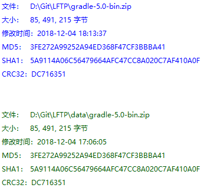
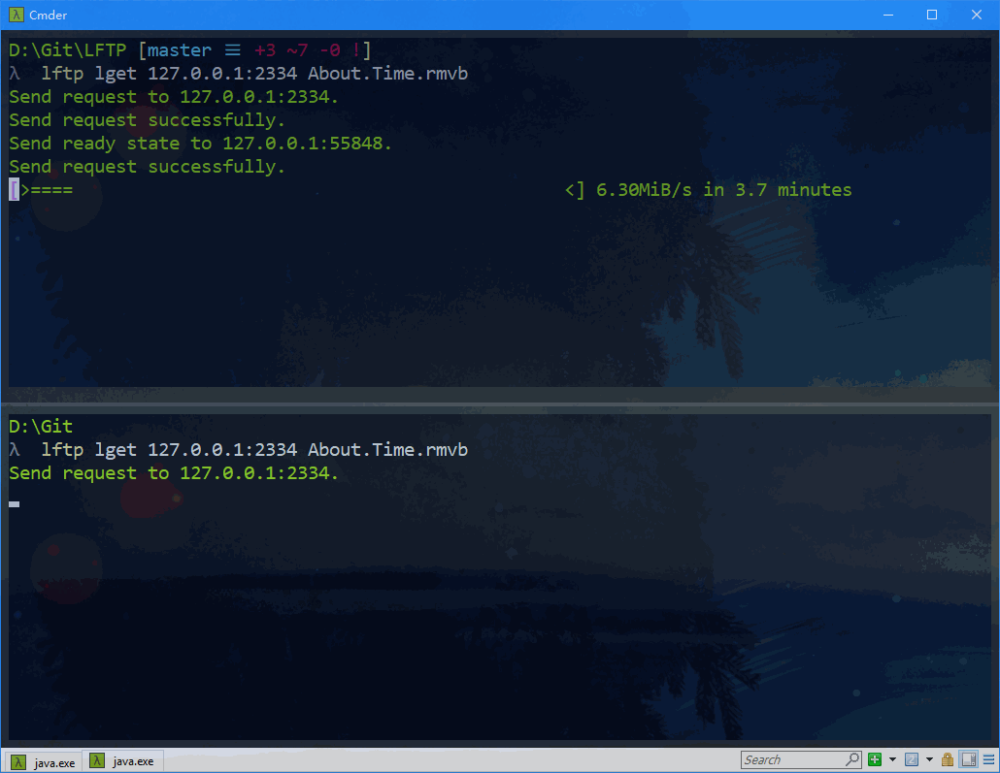
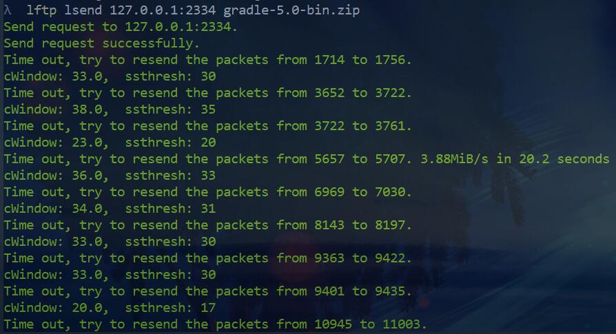
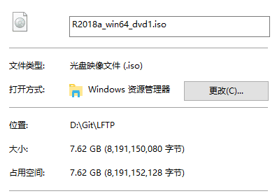
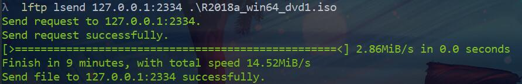
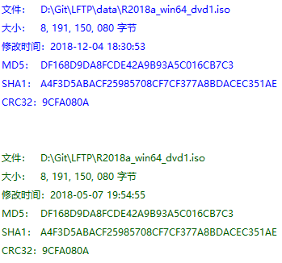

# LFTP测试文档

## 运行方式

在 `lftp-1.0.0/bin/` 下：

```sh
lftp lget ip[:port] filename
# e.g. lftp lget xxx.xxx.xxx.xxx photo.jpg
# e.g. lftp lget xxx.xxx.xxx.xxx:2333 photo.jpg

lftp lsend ip[:port] filename
# e.g. lftp lsend xxx.xxx.xxx.xxx example.txt
# e.g. lftp lsend xxx.xxx.xxx.xxx:2333 example.txt

lftp serve [-p port] [datafolder]
# e.g. lftp serve
# e.g. lftp serve -p 5555
# e.g. lftp serve -p 5555 mydata/
```

## 测试serve

服务器工作。


## 测试lget


如下，上面为下载的文件，下面为服务器上的文件原本，两份文件是一样的，说明下载成功。



## 测试lsend


## 测试多用户拥塞

当两个客户端同时请求服务器上的同一文件时，出现拥塞，传输文件的速率明显较低。



## 测试拥塞控制和超时重传

为程序添加注释后再次运行，可见拥塞窗口、慢启动阈值的变化，以及丢包事件。



## 测试大文件传输

要发送的大文件：



大文件的传输（从客户端到服务器）：



大文件的对比：

上面为服务器接收到的文件，下面为客户端发送的文件。可见，两份文件是一样的，大文件传输成功。



## 测试互联网传输

向互联网上的服务器上传文件，请求成功，传输成功。


